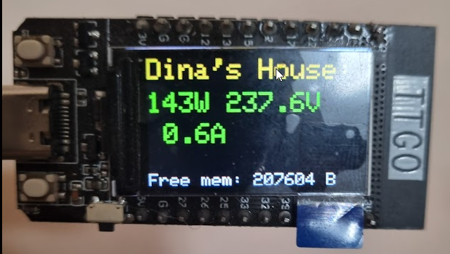

<!-- ABOUT THE PROJECT -->
## Energy Monitor Display using a Shelly EM device and ESP32
Arduino project to display real-time energy data from a Shelly EM device on a TFT display connected to an ESP32 module.<br />
It uses the Shelly Cloud API, make sure device is cloud-connected (it is by default). <br />
Shelly API returns JSON formatted data, we parse it using ArduinoJson library.<br />

I made this as a starting point for an electrical info display for my own smart-house setup.<br />
This is just my personal hobby project, but maybe it's useful for someone else too.

(I have left the very first test sketch in extras/ folder, for quick test using Arduino IDE)



### Components used

* [https://www.shelly.com/en/products/energy-metering] (Any Shelly device with Energy Metering)
* [https://www.aliexpress.us/item/1005003680319016.html] (LilyGo TTGO T-Display (ESP32 module with TFT)
* [https://platformio.org/install/ide?install=vscode] (PlatformIO IDE for Arduino development in VS Code)

### Setup

* Rename include/secrets.h.example to secrets.h and fill it with your device details
  ** MAKE SURE NOT TO COMMIT THIS IN PUBLIC GIT REPO (secrets.h must be in .gitignore)
* Configure lib/TFT_eSPI/User_Setup_Select.h for your display

### Planned features
* Connect directly to Shelly device API over local LAN (Initial development was done off-site, only cloud possible)

### Possible TFT_eSPI issue (if using IDE installed version instead of included lib/TFT_espi version)
Note: I use a local copy of TFT_eSPI library in my projects to easily use different displays across my projects.

Using TFT_eSPI driver 2.5.43, I first got compile errors:
```
In file included from c:\Users\andersen.32\Documents\Arduino\libraries\TFT_eSPI\TFT_eSPI.cpp:24:
c:\Users\andersen.32\Documents\Arduino\libraries\TFT_eSPI\Processors/TFT_eSPI_ESP32.c: In member function 'void TFT_eSPI::begin_SDA_Read()':
c:\Users\andersen.32\Documents\Arduino\libraries\TFT_eSPI\Processors/TFT_eSPI_ESP32.c:72:3: error: 'gpio_set_direction' was not declared in this scope
   72 |   gpio_set_direction((gpio_num_t)TFT_MOSI, GPIO_MODE_INPUT);
```
I fixed this by adding
```
#include "driver/gpio.h"
#include <rom/ets_sys.h>
to Processors\TFT_eSPI_ESP32.h
```

## Acknowledgments
* It uses Timemark.h from Mikael Patel
  
## Contact
Ken-Roger Andersen [https://www.linkedin.com/in/kenny1342]